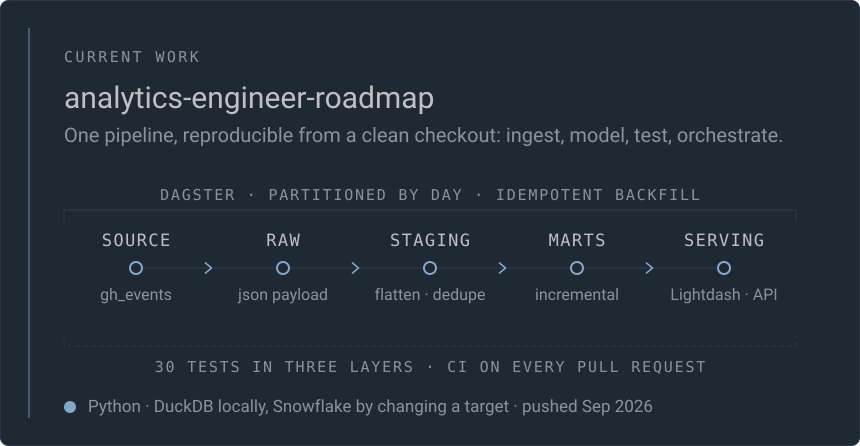
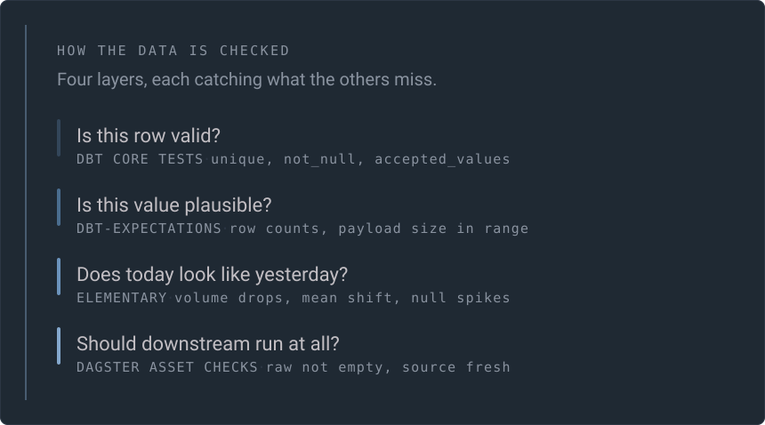
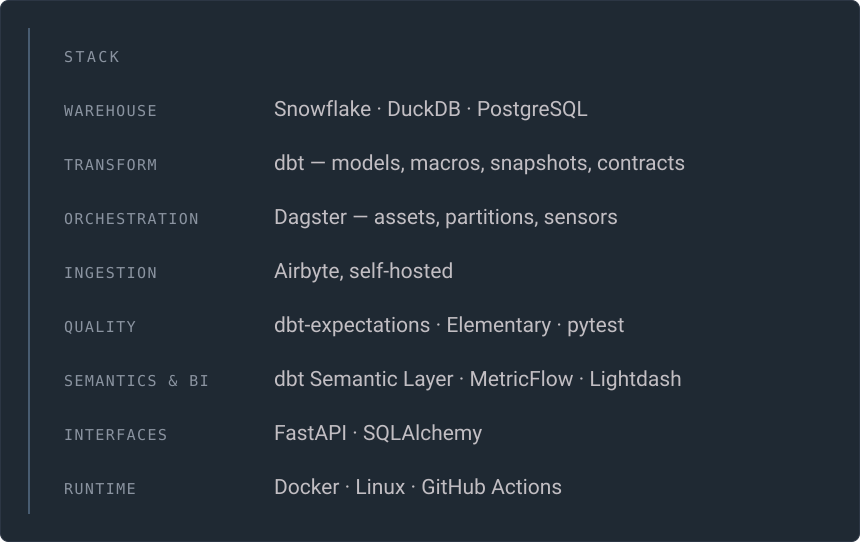

 

I build the layer between raw data and the numbers people actually trust. Ingestion,
modelling, tests, orchestration, and a BI surface that does not lie — assembled in the
open, one working piece at a time, and reproducible from a clean checkout.

 

 

 

 

 

 

A test suite that has never failed is an unverified test suite, so the roadmap repository
corrupts its own warehouse on purpose, asserts the tests go red, and restores it.

アナリティクス・エンジニア　·　<a href="https://github.com/Seinokojii?tab=repositories">repositories</a>　·　panels rebuilt nightly from the GitHub API by <a href="./assets/build.py">assets/build.py</a>
