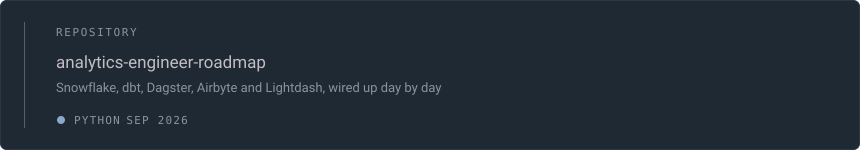

 

  <h2>Building the bridge between raw data and truth</h2>
  

    <em>Ingestion → Modeling → Testing → Orchestration → Analytics</em>
  

 

I craft data pipelines that don't lie. Taking a full analytics-engineering stack apart and putting it back together in the open — **one concept, one commit, every day**.

**Focus areas:**
- 🏗️ Data warehousing & transformations (Snowflake, PostgreSQL, dbt)
- 🔄 Orchestration & workflow automation (Dagster, Airbyte)
- 📊 Analytics & visualization (Lightdash, SQL)
- 🧪 Data quality & testing frameworks
- 🐧 Infrastructure as code (Docker, Linux)

 

### 🛠 Stack

 

### 📚 Main Projects

 

### 📖 Learning Path

Going through the roadmap systematically:
- **Phase 1:** Warehouse & Transformations
- **Phase 2:** Orchestration & Automation  
- **Phase 3:** Monitoring & Data Quality
- **Phase 4:** Advanced Analytics & Optimization

One concept. One build. One commit. Every evening.

 

  
    <strong>アナリティクス・エンジニア</strong>
     
    <a href="https://github.com/Seinokojii?tab=repositories">repositories</a> · 
    <a href="https://github.com/Seinokojii?tab=stars">starred</a> · 
    <a href="https://github.com/Seinokojii?tab=following">following</a>
  

 

---

  🚀 Building in public | Data-driven thinking | Open source first

