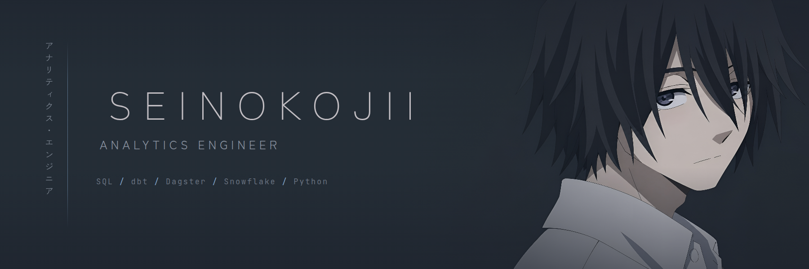
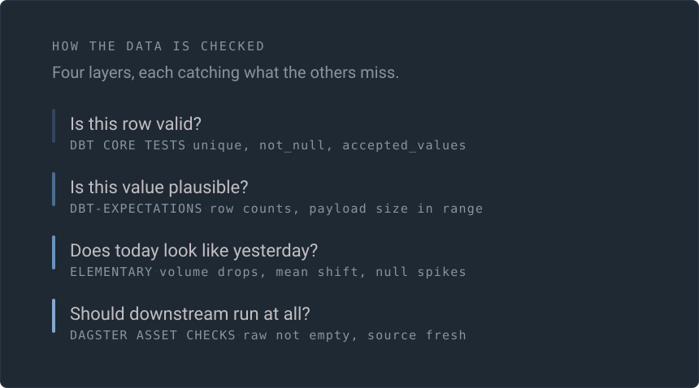
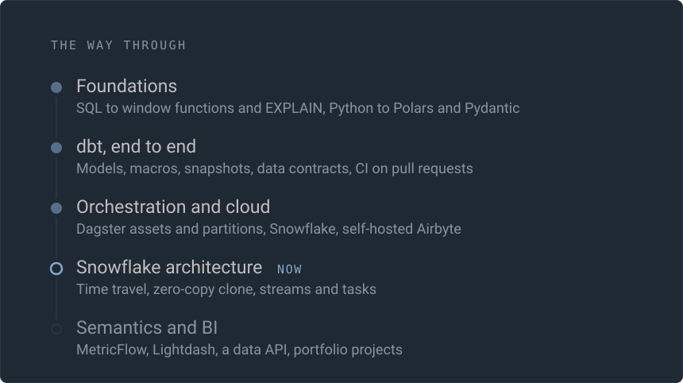
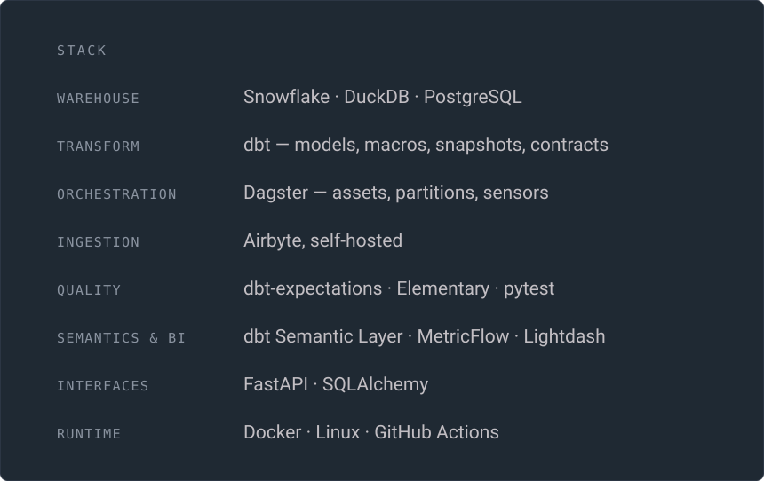
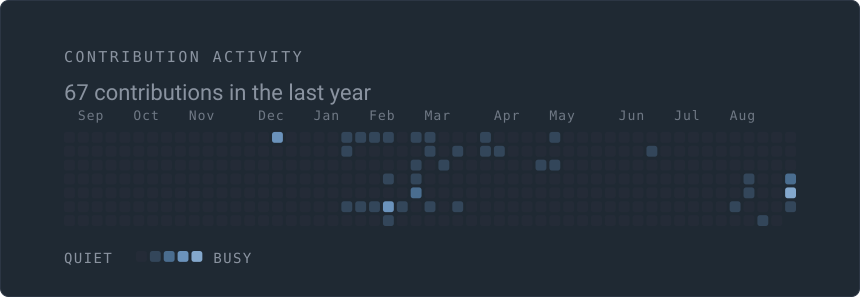

 

I build the layer between raw data and the numbers people actually trust. Ingestion,
modelling, tests, orchestration, and a BI surface that does not lie — assembled in the
open, one working piece at a time, and reproducible from a clean checkout.

 

### Recent work

<!-- recent starts -->
- [Days 94-96 Streams + Tasks](https://github.com/Seinokojii/analytics-engineer-roadmap/commit/0febafa083e7823b39a901b62b78bd9d513d4406) &nbsp;02 Sep 2026
- [Days 91-93 Time Travel + Zero Copy Clone](https://github.com/Seinokojii/analytics-engineer-roadmap/commit/354f44df208143d735614b3db5e1a2386091cda1) &nbsp;22 Aug 2026
- [Days 89-90 documentation + GitHub](https://github.com/Seinokojii/analytics-engineer-roadmap/commit/64fd4facec9c2b5bf0ef65c3b96195d843a610a8) &nbsp;13 Aug 2026
- [Days 86-88 testing + monitoring (dbt-expectations, Elementary, CI, Docker)](https://github.com/Seinokojii/analytics-engineer-roadmap/commit/295426433feaa7d4c3b33ca14c3a6f8b98b2ed69) &nbsp;12 Aug 2026
- [Days 81-85 production pipeline Airbyte -> dbt -> marts on Dagster](https://github.com/Seinokojii/analytics-engineer-roadmap/commit/be5f6cd4b39d87877b9fb06968e175f5b31cb2ec) &nbsp;07 Aug 2026
<!-- recent ends -->

 

 

The full curriculum, block by block

 

| Block | | Covered |
|---|---|---|
| **Foundations** | Days 1-30 | SQL from joins to window functions, Python to pandas and Polars, first ETL patterns |
| **Advanced SQL, testing, dbt** | Days 31-60 | Recursive CTEs, QUALIFY, MERGE, EXPLAIN ANALYZE; dbt models, macros, snapshots, contracts; pytest and Great Expectations |
| **Orchestration and cloud** | Days 61-90 | Dagster software-defined assets, partitions and sensors; Snowflake architecture and loading; self-hosted Airbyte; the first end-to-end pipeline with tests, CI and docs |
| **Snowflake architecture** | Days 91-130 | Time travel, zero-copy clone, streams and tasks, Snowpipe; medallion layering; MetricFlow; FastAPI as a data API |
| **Semantics, BI and portfolio** | Days 131-165 | Lightdash on top of the semantic layer, then three portfolio builds |

Each block ends with a project that has to run from a clean checkout, not a notebook
that only works on my machine.

 

 

 

A test suite that has never failed is an unverified test suite, so the roadmap repository
corrupts its own warehouse on purpose, asserts the tests go red, and restores it.

アナリティクス・エンジニア　·　<a href="https://github.com/Seinokojii?tab=repositories">repositories</a>　·　this page rebuilds itself nightly from the GitHub API — <a href="./assets/build.py">assets/build.py</a>
