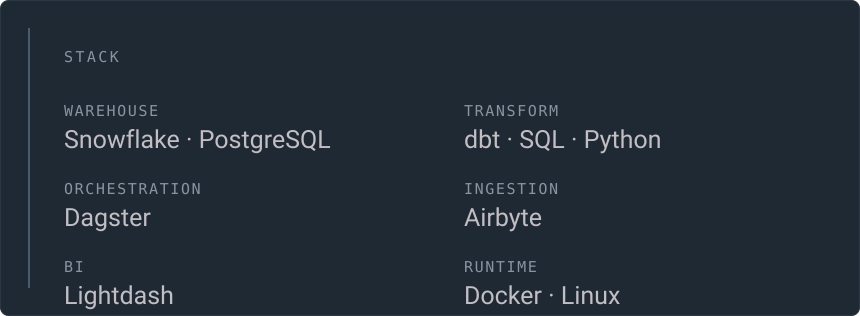
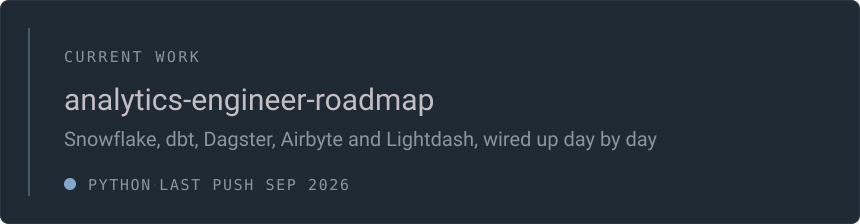

 

I build the layer between raw data and the numbers people actually trust: ingestion,
modelling, tests, orchestration, and a BI surface that does not lie. Right now I am
taking a full analytics-engineering stack apart and putting it back together in the open.

 

 

 

 

Going through the roadmap one day at a time: one concept, one thing built by hand,
committed the same evening. Warehouse and transformations first, orchestration after.

アナリティクス・エンジニア　·　<a href="https://github.com/Seinokojii?tab=repositories">repositories</a>　·　panels rebuilt nightly from the GitHub API by <a href="./assets/build.py">assets/build.py</a>
